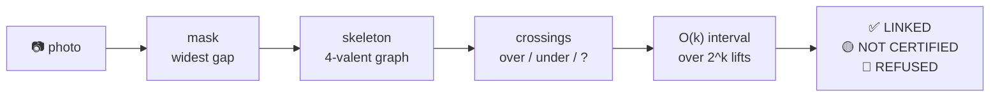

<h1 align="center">tangle</h1>

<p align="center"><b>Photograph a pile of cables. Get an integer with a proof.</b></p>

<p align="center">
  Knot theory doing a chore. <code>|lk| &gt;= 1</code> is a mathematical certificate that
  the two cables <b>cannot be pulled apart</b> — go unplug one. When the photograph can't
  read a crossing, <code>tangle</code> doesn't guess. It refuses, and names the crossing to
  re-shoot.<br>
  Today the pictures are rendered, not photographed — <a href="#️-limits">the scope is stated
  up front</a>, and the pipeline that consumes them is the same one.
</p>

<p align="center">
  Invented by <b>Teerth Sharma</b> · <a href="mailto:teerths57@gmail.com">teerths57@gmail.com</a> · <a href="https://github.com/teerthsharma/tangle">github.com/teerthsharma/tangle</a>
</p>

<p align="center">
  <a href="https://github.com/teerthsharma/tangle/blob/main/RESULTS.md"></a>
  
  
  <a href="https://github.com/teerthsharma/tangle/blob/main/pyproject.toml"></a>
  <a href="#-what-it-certifies-and-what-it-refuses"></a>
  
</p>

<p align="center">
  
</p>

<p align="center"><i>Four frames, one pile: bare scene → traced cables → numbered crossings → the
verdict stamped on the picture. This one is a <b>refusal</b>. Every frame carries the diagram
digest, so the GIF cannot be faked frame by frame.</i></p>

```bash
pip install tanglekit     # or:  uv add tanglekit
tangle --synthetic --seed 2 --overlay verdict.png
```

<sub>The distribution is <code>tanglekit</code> — plain <code>tangle</code> on PyPI is taken by an
unrelated package. The import and the command stay <code>tangle</code>.</sub>

> ### 📈 `+10.3` points of certified coverage, at **0 wrong certificates**
>
> Over 2,000 diagrams, against the four-line *"refuse on any unknown crossing"* baseline —
> which also scores zero errors. **23.6%** certified against **13.2%**. That gap is the entire
> argument for the interval theorem, and it is the only row that could have come out badly.
> → [RESULTS.md §1](https://github.com/teerthsharma/tangle/blob/main/RESULTS.md#1-the-headline-coverage-at-zero-wrong-certificates)

```
==============================================================================
  CERTIFIED  LINKED                                                   lk = 1
==============================================================================
  interval    [1, 1]   S = 2
  advice      lk = 1 over all 2^0 resolutions. The cables cannot be separated
              while their ends stay put. Unplug one.
  digest      dbf326cac84c8ff361d8e56a2e018c07c6f09333
==============================================================================
```

<details>
<summary>the rest of the verdict block, including the convention it is invariant under</summary>

```
  witness     lk
  source      from_braid([1, 1, 1, -1, 1, -1], strands=2)
------------------------------------------------------------------------------
  convention  The scene is a ball. Each cable is an arc properly embedded in
              it, with its two ends fixed where the cable leaves the picture.
              The verdict is invariant under any motion of the cables inside
              the scene that keeps them disjoint and keeps all four ends
              fixed. Nothing is claimed about what the cables do outside the
              picture.
==============================================================================
overlay -> verdict.png
```

</details>

**Zero-shot. No training. No neural network. No dataset. No GPU.** Just `numpy`, `scipy`,
`scikit-image`, `pillow` and a theorem from 1833. Runs on-device and offline on a laptop CPU —
the certified layer turns out 2,000 verdicts in **about 0.3 s** (0.29-0.31 s over three runs).
The imaging layer is not timed yet.

---

## ⚙️ How it works



1. 🎨 **Segment.** Threshold at the *widest representable gap* in the cable-ness histogram. No gap in the photograph means no threshold and no verdict — it refuses instead of picking a number.
2. 🦴 **Skeletonise.** Mask → centrelines → a 4-valent planar graph. Every node is a crossing, numbered reproducibly, so two machines number them identically.
3. 👁️ **Read over/under.** *Occlusion* continuity, and nothing else: the under-strand's own mask is interrupted where the other cable crosses it, so the cable whose trace had to be bridged across a gap is the one underneath. For opaque cables the silhouette of the union carries no depth at all, which kills every geometric cue. Where neither cable was interrupted there is no evidence, and the crossing is **UNKNOWN** — never a low-confidence "over".
4. ➕ **Sign the crossings.** A crossing's sign factors into an in-plane part read from the two tangents (which needs no depth at all) times `±1` for who is on top.
5. 🔒 **Certify.** Half the signed sum is the **Gauss linking number**: an exact integer, a topological invariant. Over every unreadable crossing at once the achievable set is an *interval*. Interval excludes zero → **LINKED, proved**.

---

## 🧮 The math, in one screen

**The invariant.** Sum the signs of the crossings *between* the two cables, and halve it:

```math
\mathrm{lk}(A,B)\;=\;\frac{1}{2}\sum_{c\,\in\,C(A,B)}\varepsilon(c),
\qquad
\varepsilon(c)\;=\;\underbrace{\mathop{\mathrm{sgn}}\det\big[\,t_a\;\;t_b\,\big]}_{\mathrm{base}(c)\,:\ \text{in-plane, no depth}}\;\cdot\;\underbrace{x_c}_{\pm 1,\ +1\ \text{iff}\ A\ \text{is over}}
```

That integer is an **isotopy invariant**: bend the cables, drape them, re-route them, walk round
and shoot from the other side — as long as the four ends stay pinned where they leave the
picture, `lk` does not move. It is **camera-angle invariant by theorem**, which is exactly the
property a CNN trained on rope photographs does not have.

**The unknowns.** Both factors of `ε(c)` are `±1`, so `lk` is **affine** in every crossing the
photograph could not read. With `S` the signed sum over the readable inter-component crossings
and `k` unreadable ones, the set of linking numbers achievable over all `2^k` resolutions is
*exactly* `k+1` consecutive integers:

```math
\Big\{\,\mathrm{lk}\,\Big\}_{2^k}\;=\;\Big\{\ \tfrac{S-k}{2}+j\ :\ j=0,1,\dots,k\ \Big\},
\qquad
\mathrm{lk}_{\min}=\tfrac{S-k}{2},\qquad \mathrm{lk}_{\max}=\tfrac{S+k}{2}
```

Computed in **`O(k)`. No enumeration. No sampling. No posterior.** Certification is
`lk_min > 0` or `lk_max < 0`, and since the interval is contiguous with step 1 those three
outcomes are exhaustive — there is no fourth case hiding.

This is an **interval certificate**, not a confidence score. Every over/under assignment on a
4-valent plane graph is a realisable link diagram, so the `2^k` orbit is the *exact* set of
tangles consistent with what the camera saw — not a heuristic superset, not a sample. Verified
against explicit `2^k` enumeration: **`0/1000` patterns disagree**, over 192,540 enumerated lifts.

> 🧠 **Explainable AI, minus the AI.** The output is an integer, the crossings it came from, the
> theorem it came from, and a SHA-1 digest of the diagram it came from. Nothing is learned,
> nothing is fitted, nothing is a black box. Run it twice, get the same integer.

---

## ✅🟡🛑 What it certifies, and what it refuses

<p align="center">
  
  
  
</p>

**The certificate is one-directional.** This is the part everyone gets backwards.

| verdict | when | what it means | exit |
|---|---|---|---|
| ✅ **CERTIFIED LINKED** | the interval excludes zero | **Proved.** No motion separates these cables with their ends held. *Unplug one.* | `0` |
| ✅ **CERTIFIED SEPARABLE** | one cable is the over-strand at **every** inter-component crossing | **Proved**, by a different and independently sufficient witness. *Just pull.* | `0` |
| 🟡 **NOT CERTIFIED** | `lk = 0`, or both cables are over somewhere | The computation succeeded and **proves nothing** | `1` |
| 🛑 **REFUSED** | the interval straddles zero, or the trace is defective | The computation **declined**, with a cause and a next action | `2` |
| ⚫ **BAD INPUT** | the file cannot be read, or the flags do not parse | Not a verdict — the tool never ran | `3` |

🔴 **`lk = 0` is never "unlinked".** The Whitehead link has `lk = 0` and does not come apart. The
word *unlinked* is a banned substring inside this package, enforced by a test that greps the
source and every verdict the example set can produce. `SEPARABLE` is reachable only from the
over-everywhere witness, never from a zero linking number.

🎯 **Refusal is a first-class output with its own exit code, and it is where active perception
lives.** When the interval straddles zero the tool prints the minimum number of crossings that
must be resolved before *any* certificate is possible, names one, gives its pixel coordinates,
and emits a camera bearing — rotate about the bisector of the two tangents and the apparent
crossing angle opens toward 90°:

```
REFUSED  LK_STRADDLES_ZERO
look at  crossing 1 at 275,279, camera bearing 152 deg
advice   the achievable interval [0, 1] contains 0
```

Other refusals name their own cause too: `NO_INTENSITY_GAP` (the photograph does not separate
cable from background), `NOT_TWO_COMPONENTS` (two visually distinct cables are required),
`BRANCHED_SKELETON`, `OPEN_TRACE`, and `ODD_CROSSING_PARITY` — a parity theorem that catches
every *odd*-cardinality tracer error, for free, with probability 1.

---

## 📊 Benchmarks

Every block below is pasted from the command above it, at commit `ac84ca0` — the last commit
that changed code — on one machine. No number in this repository is hand-typed.
**[Full tables, every control, and every arm that lost](https://github.com/teerthsharma/tangle/blob/main/RESULTS.md)**.

### The headline — coverage at zero wrong certificates

```
python bench.py

==============================================================================
  certified pairs, at 0 wrong certified verdicts
  400 braid seeds x k = 0..4 blurred crossings = 2000 entries
==============================================================================
    tangle                                 23.6%   0 wrong (<=0.6% of certified at 95%)
    abstain on any unknown crossing        13.2%   0 wrong (<=1.1% of certified at 95%)
    ------------------------------------------------
    coverage gained by the interval theorem  10.3   points
==============================================================================
  commit ac84ca0   machine WIN-16QAL06O9GB   python 3.11.9   0.29 s
==============================================================================
```

Ground truth is **not** the package's own arithmetic. Every entry is a closed braid word, and
`lk` is half the signed exponent sum over the inter-component letters — known in closed form
before any code runs. The verdict split, the active-perception control that lost, the `k`
histogram among certified verdicts, and the arms that were not run are all in the same block →
[RESULTS.md §1](https://github.com/teerthsharma/tangle/blob/main/RESULTS.md#1-the-headline-coverage-at-zero-wrong-certificates).

### Photograph to verdict, on the rendered corpus

**100% over/under on every accepted crossing** across four nuisance arms, and **45 certified,
0 wrong, 34 refused** out of 80 rendered piles. Same extracted diagrams with the over/under
reader swapped for a coin flip: **32 wrong certificates against 0**. The corpus is not too easy
— a guesser fails loudly on it.
→ [RESULTS.md §3](https://github.com/teerthsharma/tangle/blob/main/RESULTS.md#3-photograph-to-verdict-the-rendered-corpus)

### Reproduce all of it

```bash
python -m venv .venv && . .venv/*/activate   # .venv\Scripts\activate on Windows
pip install -e ".[test]"
pytest -q                # 204 passed, 2 skipped
pytest -q -s             # the same run, with the tables above printed
python bench.py          # the coverage table
python -m tangle --synthetic --seed 1
```

---

## 📚 Prior art

Nothing in the certified layer is new. Saying so first is what makes the rest believable.

| work | what they have that this does not | what `tangle` adds |
|---|---|---|
| **Matsuno et al. 2006** ([TMECH](https://doi.org/10.1109/tmech.2006.878557)) | the pipeline itself: photo → topological rope model → knot invariant → verdict, published in 2006 | an explicit UNKNOWN state, certification over the achievable interval, refusal that names a crossing, open code |
| **KnotDLO** ([arXiv:2506.22176](https://arxiv.org/abs/2506.22176)) | it acts — ties knots on real hardware, 50% on overhand from unseen configurations | an invariant, a hard certificate, and a calibrated abstention |
| **Knots-10** ([arXiv:2603.23286](https://arxiv.org/abs/2603.23286)) | real rope photographs at scale, and a 58–69 pp accuracy collapse from studio images to phone photos | an invariant that is material-, colour- and viewpoint-independent **by construction** |
| **pyknotid / Spherogram / SnapPy** ([repo](https://github.com/3-manifolds/Spherogram)) | every invariant here, computed better and more generally — the third-party control this repo owes them | the image half, which is where 100% of the risk lives |

Two honesty notes on that table. Matsuno's paper is paywalled and unread here, so if either of
their invariants is the linking number the novelty scopes down to orbit + pinning + refusal.
And `tangle` must not claim to beat the Knots-10 studio-to-phone collapse until it has been run
on their images.

Also standing on: **Gauss 1833** (the linking integral and the half-sum), **Goeritz 1933** and
**Gordon–Litherland 1978** (`det(L) = |Δ(−1)|`), **Habegger–Lin 1990** (string links),
**HANDLOOM** ([arXiv:2303.08975](https://arxiv.org/abs/2303.08975), whose learned cable tracer
is better than this one), and **Lui & Saxena 2013**, who did the ambiguity orbit as a
particle-filter posterior. The one real difference from them is *exactness and one-sidedness*:
a hard certificate plus an abstention, instead of a posterior plus a threshold.

---

## 💥 What we got wrong

Five design verdicts that are now dead, and two arms that lost after they shipped.

- 🪦 **"`lk = 0` means just pull."** The Whitehead link. Killed, and the word is banned in code.
- 🪦 **"Closing the diagram at the frame boundary makes `lk` camera-invariant."** It does not: the exit points move with the camera, and an exterior crossing's over/under is a *convention* that does not flip when its planar sign does. **The closure was deleted.** The object is a 2-string tangle with pinned ends, which needs no closure at all.
- 🪦 **"A width bump at the crossing reads over/under."** For opaque cables the silhouette is *provably* depth-blind — the mask is bitwise identical under swapping which cable is on top. The cue carried zero information and was reading the renderer's drop shadow. There is now a test called `test_silhouette_carries_no_depth`.
- 🪦 **"A contraction radius fixed in cable widths merges the skeleton's H-pattern."** It cannot: the bridge of an H at crossing angle θ is about `w / sin θ` long, so a constant radius always loses the shallow crossings. Replaced by an angle-aware admissibility rule on the bridge length (`vision.BRIDGE_K`).
- 🪦 **"`det = 5` certifies a figure-eight tie-in."** A follow-through is tied on a bight, so the doubled rope bounds a band and the traced curve is the *unknot*, `det = 1`. That is why climbing, rigging and every load-bearing verdict are out of scope: the determinant is computed, but no code path turns one into a knot name, and the verdict vocabulary (`LINKED`, `SEPARABLE`, and the refusal reasons) carries no value that could state a safety claim.
- 📉 **Active perception lost to random.** Re-shooting the crossing the tool names: 19.9% certified. Re-shooting a uniformly random crossing at the same photograph budget: 20.0%. This was **predicted before it was measured** — `lk` is affine, so every unknown shrinks the interval by exactly 1 and no crossing is more decisive than any other. The `|sin θ|` ranking is a *perception* heuristic, not an information criterion. `bench.py` prints it; it is not buried.
- 📉 **On rendered scenes the interval theorem certified nothing the plain half-sum would not have.** All 45 certified verdicts across four nuisance arms had `k = 0`. The 10.3-point coverage gap exists on the braid corpus, where the unknowns are injected on purpose.

---

## ⚠️ Limits

Collected once, here.

- **Two visually distinct cables, or it refuses.** Colour does the segmentation, so a pile of identical black charging cables is one mask and `NOT_TWO_COMPONENTS` — 15 of 80 rendered scenes. The most common real scene is the worst case, and the tool says so out loud.
- **Self-crossings are refused, not handled.** `BRANCHED_SKELETON` on 7 of 80. On a real pile most crossings are self-crossings, which makes this the single largest limit on the imaging layer.
- **Noise is a cliff, not a slope.** σ = 16/255 traces 10/10 piles; σ = 26/255 traces 0/10. The failure direction is always a refusal, never a wrong certificate, and 20 piles at each of 7 noise levels produce 0 certificates the scene contradicts.
- **Two of four nuisance arms fail the 40% refuse gate.** blur 3.0 px refuses 85%; antialiased refuses 55%.
- **It has now been run on real images, and it certified none of them.** 247 free-licensed images this repository did not make — 99 knot photographs and 72 cabling photographs from Wikimedia Commons, 27 published link diagrams, 49 line drawings from `tr33hugg3r/knot-crossings` — produce **0 certified verdicts, 0 wrong certificates, and 0 diagrams built at all**. Every one is stopped by a precondition: 104 `BRANCHED_SKELETON`, 65 `NO_INTENSITY_GAP`, 61 `NOT_TWO_COMPONENTS`, 17 `OPEN_TRACE`. The same harness certifies 13 of 20 `synth` piles through the same PNG round trip, so the zero is the corpus and not the harness → [RESULTS.md §4](https://github.com/teerthsharma/tangle/blob/main/RESULTS.md#4-real-images-247-pictures-this-repository-did-not-make).
- **Every other number here comes from `tangle.synth`**: matte constant-colour cables, no contact shadow, no specular highlight, no JPEG, no lens. Coverage, the 133 of 133 crossings read the right way round, the 32 wrong certificates the coin flip buys, `TAU`, `BRIDGE_K`, the blur and antialiasing arms, closed-cable tracing, and every asset — all of it synthetic. The invariant layer is the one exception, and it is checked against closed forms rather than pictures.
- **No camera model, so no viewpoint-agreement measurement.** Invariance is tested as *diagram-move* invariance (R1/R2/R3), which is strictly weaker than camera invariance. The two-view interval intersection exists and is unwired.
- **The corpus cannot exhibit `|lk| ≥ 2`.** An arch weaving across an arch cannot wrap twice; `|lk| ≥ 2` lives only in the `T(2,n)` family, which never goes through a camera.
- **An even number of tracer errors is uncaught** and can produce a confidently wrong certified integer. Parity catches odd counts; nothing single-view catches pairs. This is the live false-certification path, stated here rather than discovered in a bench → [RESULTS.md §7](https://github.com/teerthsharma/tangle/blob/main/RESULTS.md#7-claims-not-earned).
- **The certificate answers a narrower question than you will ask.** "Cannot be separated with the ends held" is not "will be annoying to untangle". An `lk = 0` pile can still be a nightmare of friction.
- **Never claimed, in any code path or string:** *unlinked* from `lk = 0`; *unknotted* from `det = 1`; a knot name from any determinant; chirality; a probability, confidence or percentage attached to a verdict; any climbing, rigging or safety verdict; anything at all about the cables outside the frame.

---

## 🗺️ Roadmap

- 📱 **Phone.** The certified layer is integer arithmetic with no dependencies — WebAssembly, then a camera app that refuses out loud and tells you where to stand.
- 🪢 **Degree-4 junction resolution by tangent continuation**, with a decisiveness margin so an ambiguous blob still refuses. This is the one gate that would move the real-image number: it is 104 of the 247 refusals, and nothing downstream of it has ever seen a real picture.
- 📷 **More real photographs.** Knots-10 ([arXiv:2603.23286](https://arxiv.org/abs/2603.23286), 1,440 images / 10 classes) and HANDLOOM's annotated RGB-D cable traces are downloadable and need no camera. `real.py` already prints the refuse rate and the refusal-reason histogram, which is what ships before any accuracy claim.
- 🎥 **Multi-view.** `certify.intersect` already intersects two views' intervals, and disjoint intervals *prove* one trace is wrong. It needs a camera model before it is worth wiring up.
- 🔢 **The Alexander determinant at `t = −1`.** Implemented and checked against a closed-form ladder (`det(T(2,n)) = n`, figure-eight 5, Whitehead 8), but it is genuinely nonlinear in the unknowns: no interval bound of the `O(k)` kind exists, so it needs the `2^k` enumeration under a measured budget (`K_MAX = 16`, set from the 39 µs per lift at ten crossings in [RESULTS.md §2](https://github.com/teerthsharma/tangle/blob/main/RESULTS.md#2-the-invariant-layer-against-closed-forms)).

---

<p align="center"><sub>
<a href="https://github.com/teerthsharma/tangle/blob/main/LICENSE">MIT</a> · python ≥ 3.10 · <a href="https://github.com/teerthsharma/tangle/blob/main/RESULTS.md">RESULTS.md</a> ·
Invented by <b>Teerth Sharma</b> · teerths57@gmail.com ·
<a href="https://github.com/teerthsharma/tangle">github.com/teerthsharma/tangle</a><br>
<code>knot-theory · linking-number · topological-invariant · computer-vision · zero-shot ·
certified · active-perception · explainable-ai</code>
</sub></p>
