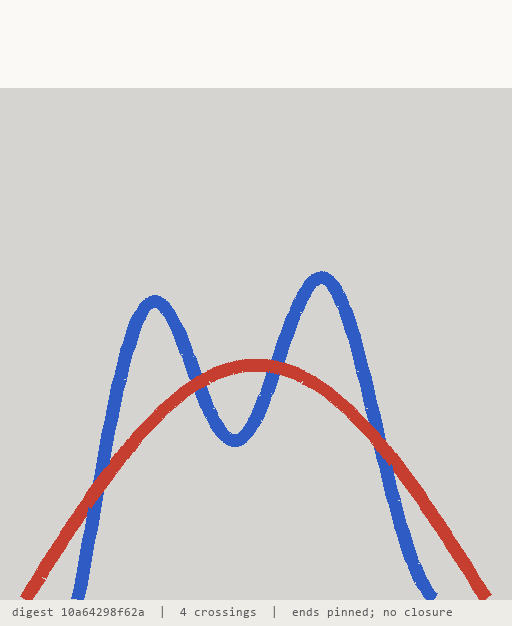
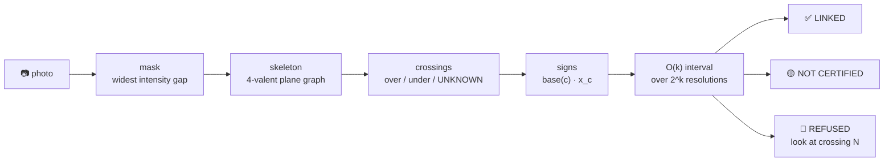

<h1 align="center">tangle</h1>

<p align="center"><b>Photograph a pile of cables. Get an integer with a proof.</b></p>

<p align="center">
  Knot theory doing a chore. <code>|lk| &gt;= 1</code> is a mathematical certificate that
  the two cables <b>cannot be pulled apart</b> — go unplug one.<br>
  When the photograph can't read a crossing, <code>tangle</code> doesn't guess. It refuses,
  and names the crossing to re-shoot.
</p>

<p align="center">
  Invented by <b>Teerth Sharma</b> ·
  <a href="mailto:teerths57@gmail.com">teerths57@gmail.com</a> ·
  <a href="https://github.com/teerthsharma/tangle">github.com/teerthsharma/tangle</a>
</p>

<p align="center">
  
  
  
  
  
  
</p>

<p align="center">
  
</p>

<p align="center"><i>Four frames, one pile: bare scene → traced cables → numbered crossings →
the verdict stamped on the picture. This one is a <b>refusal</b> — the achievable interval is
<code>[0, 1]</code>, it contains 0, so nothing is certified and crossing 1 is ringed with a camera
bearing. Every frame carries the diagram digest, so the GIF cannot be faked frame by frame.</i></p>

```bash
pip install git+https://github.com/teerthsharma/tangle
```

```bash
python -m tangle --synthetic --seed 2 --overlay verdict.png
```

```
==============================================================================
  CERTIFIED  LINKED                                                   lk = 1
==============================================================================
  witness     lk
  interval    [1, 1]   S = 2
  advice      lk = 1 over all 2^0 resolutions. The cables cannot be separated
              while their ends stay put. Unplug one.
  source      from_braid([1, 1, 1, -1, 1, -1], strands=2)
  digest      dbf326cac84c8ff361d8e56a2e018c07c6f09333
------------------------------------------------------------------------------
  convention  The scene is a ball. Each cable is an arc properly embedded in
              it, with its two ends fixed where the cable leaves the picture.
              The verdict is invariant under any motion of the cables inside
              the scene that keeps them disjoint and keeps all four ends
              fixed. Nothing is claimed about what the cables do outside the
              picture.
==============================================================================
overlay -> verdict.png
```

> ### 📈 `+10.3` points of certified coverage, at **0 wrong certificates**
>
> Over 2,000 diagrams, against the four-line *"refuse on any unknown crossing"* baseline —
> which also scores zero errors. **23.6%** certified against **13.2%**. That gap is the entire
> argument for the interval theorem, and it is the only row that could have come out badly.
> → [RESULTS.md §1](RESULTS.md)

**Zero-shot. No training. No neural network. No dataset. No GPU.** Just `numpy`, `scipy`,
`scikit-image`, `pillow` and a theorem from 1833. Runs on-device and offline on a laptop CPU —
the certified layer turns out 2,000 verdicts in **0.3 s**, real-time by any camera's standard.

---

## ⚙️ How it works



1. 🎨 **Segment.** Threshold at the *widest representable gap* in the cable-ness histogram. No gap in the photograph means no threshold and no verdict — it refuses instead of picking a number.
2. 🦴 **Skeletonise.** Mask → centrelines → a 4-valent planar graph. Every node is a crossing, numbered reproducibly, so two machines number them identically.
3. 👁️ **Read over/under.** Colour continuity through the junction core. It is allowed to say **UNKNOWN**, and it does — UNKNOWN is never a low-confidence "over".
4. ➕ **Sign the crossings.** A crossing's sign factors into an in-plane part read from the two tangents (which needs no depth at all) times `±1` for who is on top.
5. 🔒 **Certify.** Half the signed sum is the **Gauss linking number**: an exact integer, a topological invariant. Over every unreadable crossing at once the achievable set is an *interval*. Interval excludes zero → **LINKED, proved**.

---

## 🧮 The math in 60 seconds

**The invariant.** Sum the signs of the crossings *between* the two cables, and halve it:

$$
\mathrm{lk}(A,B)\;=\;\frac{1}{2}\sum_{c\,\in\,C(A,B)}\varepsilon(c),
\qquad
\varepsilon(c)\;=\;\underbrace{\operatorname{sgn}\det\big[\,t_a\;\;t_b\,\big]}_{\mathrm{base}(c)\,:\ \text{in-plane, no depth}}\;\cdot\;\underbrace{x_c}_{\pm 1,\ +1\ \text{iff}\ A\ \text{is over}}
$$

That integer is an **isotopy invariant**: bend the cables, drape them, re-route them, walk round
and shoot from the other side — as long as the four ends stay pinned where they leave the
picture, `lk` does not move. It is **camera-angle invariant by theorem**, which is exactly the
property a CNN trained on rope photographs does not have.

**The unknowns.** Both factors of `ε(c)` are `±1`, so `lk` is **affine** in every crossing the
photograph could not read. With `S` the signed sum over the readable inter-component crossings
and `k` unreadable ones, the set of linking numbers achievable over all `2^k` resolutions is
*exactly* `k+1` consecutive integers:

$$
\Big\{\,\mathrm{lk}\,\Big\}_{2^k}\;=\;\Big\{\ \tfrac{S-k}{2}+j\ :\ j=0,1,\dots,k\ \Big\},
\qquad
\mathrm{lk}_{\min}=\tfrac{S-k}{2},\qquad \mathrm{lk}_{\max}=\tfrac{S+k}{2}
$$

Computed in **`O(k)`. No enumeration. No sampling. No posterior.** Certification is
`lk_min > 0` or `lk_max < 0`, and since the interval is contiguous with step 1 those three
outcomes are exhaustive — there is no fourth case hiding.

This is an **interval certificate**, not a confidence score. Every over/under assignment on a
4-valent plane graph is a realisable link diagram, so the `2^k` orbit is the *exact* set of
tangles consistent with what the camera saw — not a heuristic superset, not a sample. Verified
against explicit `2^k` enumeration: **`0/1000` patterns disagree**, over 192,540 enumerated lifts.

> 🧠 **Explainable AI, minus the AI.** The output is an integer, the crossings it came from, the
> theorem it came from, and a SHA-1 digest of the diagram it came from. Nothing is learned,
> nothing is fitted, nothing is a black box. Run it twice, get the same integer.

---

## ✅🟡🛑 What it certifies, and what it refuses

**The certificate is one-directional.** This is the part that is usually got wrong.

| verdict | when | what it means | exit |
|---|---|---|---|
| ✅ **CERTIFIED LINKED** | the interval excludes zero | **Proved.** No motion separates these cables with their ends held. *Unplug one.* | `0` |
| ✅ **CERTIFIED SEPARABLE** | one cable is the over-strand at **every** inter-component crossing | **Proved**, by a different and independently sufficient witness. *Just pull.* | `0` |
| 🟡 **NOT CERTIFIED** | `lk = 0`, or both cables are over somewhere | The computation succeeded and **proves nothing** | `1` |
| 🛑 **REFUSED** | the interval straddles zero, or the trace is defective | The computation **declined**, with a cause and a next action | `2` |

🔴 **`lk = 0` is never "unlinked".** The Whitehead link has `lk = 0` and does not come apart. The
word *unlinked* is a banned substring inside this package, enforced by a test that greps the
source and every verdict the example set can produce. `SEPARABLE` is reachable only from the
over-everywhere witness, never from a zero linking number.

🎯 **Refusal is a first-class output with its own exit code, and it is where active perception
lives.** When the interval straddles zero the tool prints the minimum number of crossings that
must be resolved before *any* certificate is possible, names one, gives its pixel coordinates,
and emits a camera bearing — rotate about the bisector of the two tangents and the apparent
crossing angle opens toward 90°:

```
REFUSED  LK_STRADDLES_ZERO
look at  crossing 1 at 275,279, camera bearing 152 deg
advice   the achievable interval [0, 1] contains 0
```

Other refusals name their own cause too: `NO_INTENSITY_GAP` (the photograph does not separate
cable from background), `NOT_TWO_COMPONENTS` (two visually distinct cables are required),
`BRANCHED_SKELETON`, `OPEN_TRACE`, and `ODD_CROSSING_PARITY` — a parity theorem that catches
every *odd*-cardinality tracer error, for free, with probability 1.

---

## 📊 Benchmarks

Everything below is generated by the command shown, at commit `2c8cb70`, on machine
`WIN-16QAL06O9GB`, Windows 11, python 3.11.9, numpy 2.4.6 / scipy 1.17.1 / scikit-image 0.26.0 /
pillow 12.3.0. No number in this repository is hand-typed. Full tables, every control, and every
arm that lost: **[RESULTS.md](RESULTS.md)**.

### The headline — coverage at zero wrong certificates

```
.venv/Scripts/python bench.py

==============================================================================
  certified pairs, at 0 wrong certified verdicts
  400 braid seeds x k = 0..4 blurred crossings = 2000 entries
==============================================================================
    tangle                                 23.6%   0 wrong (<=0.1% at 95%)
    abstain on any unknown crossing        13.2%   0 wrong (<=0.1% at 95%)
    ------------------------------------------------
    coverage gained by the interval theorem  10.3   points

  same diagrams, decision rule replaced:
    coin flip on unknowns                  70.3%   755 wrong
==============================================================================
    tangle CERTIFIED                       23.6%
    tangle NOT CERTIFIED                    6.2%
    tangle REFUSED                         70.2%
==============================================================================
  active perception -- the ranking is a perception heuristic, and theory
  predicts no gap: every unknown shrinks the interval width by exactly 1.
    named crossing re-shot, then certified 19.9%   of 1404
    random crossing re-shot, same budget   20.0%   control
==============================================================================
  k among certified verdicts -- if this is 0 almost everywhere, then
  "certified over all 2^k resolutions" is doing less work than it sounds.
    k=0: 276  k=1: 147  k=2: 49
==============================================================================
  commit 2c8cb70   machine WIN-16QAL06O9GB   python 3.11.9   0.3 s
==============================================================================
```

Ground truth is **not** the package's own arithmetic. Every entry is a closed braid word, and
`lk` is half the signed exponent sum over the inter-component letters — known in closed form
before any code runs.

### Photograph to verdict, on the rendered corpus

```
.venv/Scripts/python -m pytest -q -s tests/test_vision.py

  over/under on accepted crossings
    clean           46/ 46  100.0%
    blur 1.0 px     48/ 48  100.0%
    blur 3.0 px      8/  8  100.0%
    antialiased     31/ 31  100.0%

  certified / wrong / refused, out of 20 piles per arm
    clean           16     0     4   (80.0% certified)
    blur 1.0 px     18     0     2   (90.0% certified)
    blur 3.0 px      3     0    17   (15.0% certified)
    antialiased      8     0    11   (40.0% certified)
    rule of three: 0 wrong in 45 certified is an upper bound of 0.067, not a rate of 0
    unknown crossings among certified verdicts: {0: 45}

  coin flip on the identical diagrams, seed 20260905
    clean          read  16 certified / 0 wrong    coin  19 certified / 11 wrong
    blur 1.0 px    read  18 certified / 0 wrong    coin  18 certified / 12 wrong
    blur 3.0 px    read   3 certified / 0 wrong    coin   2 certified /  1 wrong
    antialiased    read   8 certified / 0 wrong    coin  12 certified /  8 wrong

  refusal reasons over every arm
    NOT_TWO_COMPONENTS    15
    BRANCHED_SKELETON      7
    OPEN_TRACE             4
```

Same extracted diagrams, over/under reader swapped for a coin flip: **32 wrong certificates
against 0**. The corpus is not too easy — a guesser fails loudly on it.

### Reproduce all of it

```bash
python -m venv .venv
.venv/Scripts/pip install numpy scipy scikit-image pillow pytest
.venv/Scripts/pip install -e .
.venv/Scripts/python -m pytest -q          # 196 passed
.venv/Scripts/python -m pytest -q -s       # the same run, with the tables above printed
.venv/Scripts/python bench.py              # the coverage table
.venv/Scripts/python -m tangle --synthetic --seed 1
```

---

## 📚 Prior art

Nothing in the certified layer is new. Saying so first is what makes the rest believable.

| work | what it is | what `tangle` adds | where they are better |
|---|---|---|---|
| **Matsuno et al. 2006** — *Manipulation of deformable linear objects using knot invariants* ([TMECH](https://doi.org/10.1109/tmech.2006.878557)) | image sensor → topological rope model → two knot invariants → classify the rope's state. Twenty years old, paywalled, no public code | the explicit UNKNOWN state, certification over the achievable interval, refusal with a named crossing, the pinned-ends statement, an open implementation | **the pipeline is theirs.** photo → model → invariant → verdict was published in 2006. The paper is unread here, so if either of their invariants is the linking number the novelty scopes down to orbit + pinning + refusal |
| **KnotDLO** ([arXiv:2506.22176](https://arxiv.org/abs/2506.22176)) | robot knot tying from a crossing-sequence topological state; 50% success on overhand from unseen configurations | an invariant, a hard certificate, and a calibrated abstention | **it acts.** KnotDLO ties knots on real hardware; `tangle` only reports |
| **Knots-10** ([arXiv:2603.23286](https://arxiv.org/abs/2603.23286)) | end-to-end CNN/ViT knot classification on rope photographs; no formal invariants; 58–69 pp accuracy collapse across rope materials | an invariant that is material-, colour- and viewpoint-independent **by construction** | **real photographs, at scale, on a task `tangle` cannot do.** `tangle` must not claim to beat their cross-material collapse until it has been run on their images |
| **pyknotid / Spherogram / SnapPy** ([repo](https://github.com/3-manifolds/Spherogram)) | Goeritz matrices, determinants, linking numbers, Alexander and Jones polynomials from PD or Gauss codes | the image half — which is where 100% of the risk lives | **nothing mathematically. Every invariant here is theirs**, computed better and more generally. They are the third-party control this repo should be checked against |

Also standing on: **Gauss 1833** (the linking integral and the half-sum), **Goeritz 1933** and
**Gordon–Litherland 1978** (`det(L) = |Δ(−1)|`), **Habegger–Lin 1990** (string links),
**HANDLOOM / LTODO** (whose learned cable tracer is better than this one), and
**Lui & Saxena 2013**, who did the ambiguity orbit as a particle-filter posterior. The one real
difference from them is *exactness and one-sidedness*: a hard certificate plus an abstention,
instead of a posterior plus a threshold.

---

## 💥 What we got wrong

Five design verdicts that are now dead, and two arms that lost after they shipped.

- 🪦 **"`lk = 0` means just pull."** The Whitehead link. Killed, and the word is banned in code.
- 🪦 **"Closing the diagram at the frame boundary makes `lk` camera-invariant."** It does not: the exit points move with the camera, and an exterior crossing's over/under is a *convention* that does not flip when its planar sign does. **The closure was deleted.** The object is a 2-string tangle with pinned ends, which needs no closure at all.
- 🪦 **"A width bump at the crossing reads over/under."** For opaque cables the silhouette is *provably* depth-blind — the mask is bitwise identical under swapping which cable is on top. The cue carried zero information and was reading the renderer's drop shadow. There is now a test called `test_silhouette_carries_no_depth`.
- 🪦 **"A `1.2·w_est` contraction radius merges the skeleton's H-pattern."** It covers only crossings above ~47°. Replaced by an angle-aware rule against a measured bridge-length table.
- 🪦 **"`det = 5` certifies a figure-eight tie-in."** A follow-through is tied on a bight, so the doubled rope bounds a band and the traced curve is the *unknot*, `det = 1`. That is why climbing, rigging and every load-bearing verdict are out of scope **in code**, not in prose.
- 📉 **Active perception lost to random.** Re-shooting the crossing the tool names: 19.9% certified. Re-shooting a uniformly random crossing at the same photograph budget: 20.0%. This was **predicted before it was measured** — `lk` is affine, so every unknown shrinks the interval by exactly 1 and no crossing is more decisive than any other. The `|sin θ|` ranking is a *perception* heuristic, not an information criterion. `bench.py` prints it; it is not buried.
- 📉 **On rendered scenes the interval theorem certified nothing the plain half-sum would not have.** All 45 certified verdicts across four nuisance arms had `k = 0`. The 10.3-point coverage gap exists on the braid corpus, where the unknowns are injected on purpose.

---

## ⚠️ Limits

Collected once, here.

- **Two visually distinct cables, or it refuses.** Colour does the segmentation, so a pile of identical black charging cables is one mask and `NOT_TWO_COMPONENTS` — 15 of 80 rendered scenes. The most common real scene is the worst case, and the tool says so out loud.
- **Self-crossings are refused, not handled.** `BRANCHED_SKELETON` on 7 of 80. On a real pile most crossings are self-crossings, which makes this the single largest limit on the imaging layer.
- **Noise is a cliff, not a slope.** σ = 6/255 traces 10/10 piles; σ = 8/255 traces 0/10. The failure direction is always a refusal, never a wrong certificate.
- **Two of four nuisance arms fail the 40% refuse gate.** blur 3.0 px refuses 85%; antialiased refuses 55%.
- **No real photographs yet.** Every number here comes from `tangle.synth`: matte constant-colour cables, no contact shadow, no specular highlight, no JPEG, no lens.
- **No camera model, so no viewpoint-agreement measurement.** Invariance is tested as *diagram-move* invariance (R1/R2/R3), which is strictly weaker than camera invariance. The two-view interval intersection exists and is unwired.
- **The corpus cannot exhibit `|lk| ≥ 2`.** An arch weaving across an arch cannot wrap twice; `|lk| ≥ 2` lives only in the `T(2,n)` family, which never goes through a camera.
- **An even number of tracer errors is uncaught** and can produce a confidently wrong certified integer. Parity catches odd counts; nothing single-view catches pairs. This is the live false-certification path, stated here rather than discovered in a bench.
- **The certificate answers a narrower question than you will ask.** "Cannot be separated with the ends held" is not "will be annoying to untangle". An `lk = 0` pile can still be a nightmare of friction.
- **Never claimed, in any code path or string:** *unlinked* from `lk = 0`; *unknotted* from `det = 1`; a knot name from any determinant; chirality; a probability, confidence or percentage attached to a verdict; any climbing, rigging or safety verdict; anything at all about the cables outside the frame.

---

## 🗺️ Roadmap

- 📱 **Phone.** The certified layer is integer arithmetic with no dependencies — WebAssembly, then a camera app that refuses out loud and tells you where to stand.
- 📷 **Real photographs.** Knots-10, `tr33hugg3r/knot-crossings` and HANDLOOM's cable images are downloadable and need no camera. Refuse rate and refusal-reason histogram ship first, before any accuracy claim.
- 🪢 **Per-cable H-contraction**, so self-crossings stop being a refusal and real piles come into scope.
- 🎥 **Multi-view.** `certify.intersect` already intersects two views' intervals, and disjoint intervals *prove* one trace is wrong. It needs a camera model before it is worth wiring up.
- 🔢 **The Alexander determinant at `t = −1`.** Implemented and checked against a closed-form ladder (`det(T(2,n)) = n`, figure-eight 5, Whitehead 8), but it is genuinely nonlinear in the unknowns: no interval bound of the `O(k)` kind exists, so it needs the `2^k` enumeration under a measured budget (`K_MAX = 16`, set from 35.6 µs per lift).

---

<p align="center"><sub>
MIT · python ≥ 3.10 · <a href="RESULTS.md">RESULTS.md</a> ·
Invented by <b>Teerth Sharma</b> · teerths57@gmail.com ·
<code>knot-theory · linking-number · topological-invariant · computer-vision · zero-shot ·
certified · active-perception · explainable-ai</code>
</sub></p>
